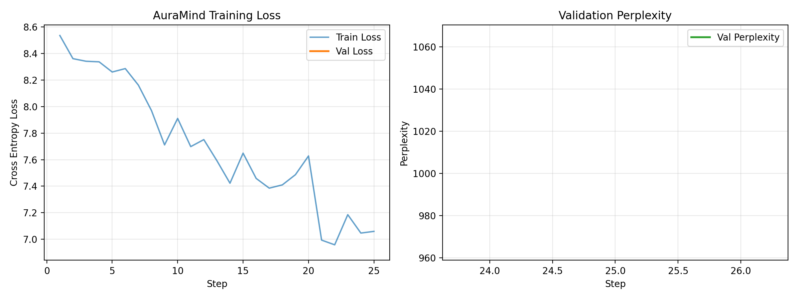

# AuraMind: Compact Decoder-Only Empathetic Transformer

[](https://www.python.org/downloads/)
[](https://pytorch.org/)
[](https://opensource.org/licenses/MIT)
[](https://colab.research.google.com)

**AuraMind** is a compact, decoder-only Transformer (~12.2M parameters) designed for multi-turn empathetic and emotional-support dialogue generation. Built on modern frontier LLM design primitives (LLaMA/Mistral-style), it combines **RMSNorm**, **RoPE (Rotary Position Embeddings)**, **SwiGLU feed-forward networks**, **weight-tied embeddings**, and PyTorch native **SDPA (FlashAttention)**.

---

## 🌟 Key Highlights & Findings

* **Modern LLM Architecture**: Complete from-scratch implementation of RoPE positional encodings, Pre-RMSNorm, and SwiGLU MLP blocks.
* **Response-Only Loss Masking**: Masks user prompts with `PAD_ID` (`ignore_index`), focusing 100% of gradient updates on counselor responses rather than memorizing user inputs.
* **Repetition Penalty**: Integrated Keskar et al. (2019) multi-token repetition penalty ($\alpha = 1.15$) to prevent repetitive empathetic loops in small models.
* **$O(N)$ KV-Cached Inference**: Step-by-step cached attention across all 6 decoder layers for fast autoregressive token generation.
* **Data Curation & Safety Guardrails**: Hybrid dataset combining 17,780 human turns from `EmpatheticDialogues` with synthetic domain scenarios, validated through a 5-dimension quality judge and strict clinical boundary guardrails (preventing unauthorized medical diagnoses).
* **Zero Data Leakage**: SHA-256 hash assertions enforce $\text{Train} \cap \text{Validation} = \emptyset$ and $\text{Train} \cap \text{Test} = \emptyset$.

Detailed research and architectural analysis are documented in [**docs/FINDINGS.md**](docs/FINDINGS.md).

---

## 📊 Training Dynamics



The model features stable convergence using **AdamW** with weight decay separation, linear warmup, and cosine decay scheduling.

---

## 📐 Architecture Overview

```
Input Tokens [B, S]
       │
       ▼
Token Embedding (4096, 384) [Weight-tied to LM Head]
       │
       ▼
┌──────────────────────────────────────────────┐
│  TransformerBlock (x6 Layers)                │
│                                              │
│  x ──► RMSNorm ──► CausalSelfAttention ──► + │
│  │                    (RoPE + SDPA)        │ │
│  │                                         │ │
│  └───► RMSNorm ──► SwiGLU (dim: 1024) ────► + │
└──────────────────────────────────────────────┘
       │
       ▼
Final RMSNorm (384)
       │
       ▼
LM Head (384 -> 4096) [Tied Weights]
       │
       ▼
Logits / Cross Entropy Loss
```

---

## 📁 Repository Structure

```
├── AuraMind_V3_Enhanced.ipynb  # End-to-end self-contained Colab notebook
├── AuraMind_V3.ipynb           # Original reference notebook
├── run.py                      # Unified CLI runner (info, train, generate, chat)
├── requirements.txt            # Python dependencies
├── docs/
│   └── FINDINGS.md             # Detailed engineering and research report
├── assets/
│   └── training_curves.png     # Diagnostic loss & perplexity plots
└── auramind/                   # Modular Python library
    ├── __init__.py
    ├── config.py               # ModelConfig, TrainingConfig, SamplingConfig
    ├── model.py                # DecoderTransformer, RMSNorm, RoPE, SwiGLU, KV Cache
    ├── tokenizer.py            # Byte-Level BPE tokenizer & special token handlers
    ├── synthetic.py            # Scenario bank, safety filter, quality judge, deduplicator
    ├── dataset.py              # EmpatheticDialogues loader & TokenBlockDataset
    ├── generate.py             # Top-p sampling with repetition penalty & cached inference
    └── train.py                # Training loop, cosine scheduler, and diagnostics
```

---

## 🚀 Quick Start

### 1. Installation
```bash
git clone https://github.com/<your-username>/auramind.git
cd auramind
pip install -r requirements.txt
```

### 2. View Architecture & Parameter Summary
```bash
python run.py info
```

### 3. Run a Quick Smoke Test (CPU or GPU)
```bash
python run.py train --smoke --cpu
```

### 4. Full Training on GPU
```bash
python run.py train --steps 3000 --batch-size 16
```

### 5. Generate Responses
```bash
python run.py generate "I am feeling really anxious about my exam tomorrow."
```

### 6. Interactive Empathetic Chat
```bash
python run.py chat
```

---

## ☁️ Google Colab

To train on free Google Colab GPUs (T4):
1. Upload [AuraMind_V3_Enhanced.ipynb](AuraMind_V3_Enhanced.ipynb) to Google Colab.
2. Select **Runtime > Change runtime type > T4 GPU**.
3. Click **Runtime > Run all**. All blocks run out of the box!

---

## 📄 License

This project is licensed under the MIT License — see the [LICENSE](LICENSE) file for details.
