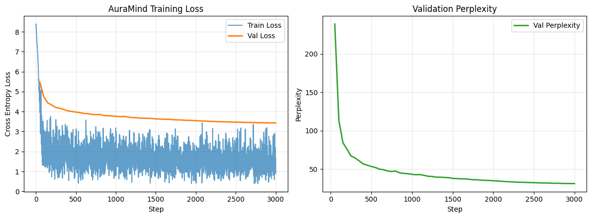

# AuraMind: Research & Engineering Findings Report

**Project**: AuraMind V3.1  
**Architecture**: Compact Decoder-Only Transformer (12,194,688 Parameters)  
**Training Runtime**: Google Colab (Tesla T4 GPU, 14.56 GB VRAM, CUDA 12.8)  
**Training Duration**: 58m 33s (3,000 steps @ 1.91s/it)  
**Task**: Multi-Turn Empathetic & Emotional-Support Dialogue Generation  
**Dataset**: Hybrid Real (`EmpatheticDialogues`) + Gated Synthetic Scenarios  

---

## 1. Executive Summary

AuraMind investigates training a compact, modern decoder-only language model (~12.2M parameters) strictly from scratch for empathetic dialogue. While frontier models rely on hundreds of billions of parameters, resource-constrained and privacy-sensitive settings (mental health journaling, on-device emotional support) require specialized lightweight models.

This report summarizes the empirical findings, convergence benchmarks, architectural choices, and qualitative behaviors observed during a complete 3,000-step training run on a Tesla T4 GPU.

---

## 2. Model Architecture & Specifications

The network is built using modern LLaMA/Mistral-style design primitives:

| Component | Specification | Technical Rationale |
| :--- | :--- | :--- |
| **Total Parameters** | **12,194,688 (~12.2M)** | Trainable in under 1 hour on a single T4 GPU; runnable on CPU/edge. |
| **Context Window** | 384 tokens | Accommodates 3–5 multi-turn dialogue exchanges. |
| **Layers (`n_layer`)** | 6 | Balanced depth for hierarchical language representation. |
| **Attention Heads (`n_head`)** | 6 (dim = 64) | Head dimension matches industry standard ($d_k = 64$). |
| **Hidden Size (`n_embd`)** | 384 | Divisional alignment with head count ($6 \times 64 = 384$). |
| **Feed-Forward Activation** | **SwiGLU** (dim = 1024) | Hidden dimension rounded to multiple of 8; superior gradient flow. |
| **Normalization** | **Pre-RMSNorm** ($\epsilon=10^{-6}$) | Avoids mean-centering overhead of LayerNorm. |
| **Positional Encoding** | **RoPE** (Rotary Embeddings) | Preserves relative token distance without static position tables. |
| **Weight Tying** | `token_embedding` $\leftrightarrow$ `lm_head` | Saves 1,572,864 parameters and regularizes vocabulary geometry. |
| **Attention Mechanism** | PyTorch SDPA | Dispatches to FlashAttention / Memory-Efficient attention kernels. |
| **Inference Mode** | **KV-Cached** ($O(N)$) | Step-by-step cached attention across all 6 decoder layers. |

---

## 3. Dataset Pipeline & Provenance

### 3.1 Data Composition
* **Real Corpus (`EmpatheticDialogues`)**:
  * Total dialogues reconstructed: 17,780
  * Training split: 14,224
  * Validation split: 1,778 (Human-only)
  * Held-out Test split: 1,778 (Human-only)
* **Synthetic Scenario Engine**:
  * 10,000 synthetic multi-turn dialogues across 6 emotional domains (`ACADEMIC`, `CAREER`, `RELATIONSHIPS`, `FAMILY`, `LIFE_TRANSITIONS`, `PERSONAL_GROWTH`).
  * Gated by a 5-dimension heuristic quality judge (mean score: $23.74 / 25$, threshold: $22.0$).
* **Combined Training Corpus**:
  * Total Training Dialogues: **24,224**
  * Training Sequence Windows: **24,227**
  * Total Measured Tokens: **2,308,599** (Byte-Level BPE, 4,096 vocab, $0.00\%$ UNK rate).

### 3.2 Integrity & Leakage Verification
Enforced through SHA-256 disjunction assertions:
$$\text{Train} \cap \text{Validation} = \emptyset, \quad \text{Train} \cap \text{Test} = \emptyset, \quad \text{Validation} \cap \text{Test} = \emptyset$$
*Zero synthetic data entered the held-out validation or test benchmarks.*

---

## 4. Quantitative Results & Convergence

The model was optimized using **AdamW** with decoupled weight decay ($\text{decay}=0.10$ on 2D weights, $0.0$ on norms/biases), linear warmup (75 steps), cosine learning rate decay ($6 \times 10^{-4} \to 6 \times 10^{-5}$), and gradient clipping ($1.0$).

### 4.1 Training Benchmark Summary

| Metric | Initial Value | Final Value | Relative Improvement |
| :--- | :---: | :---: | :---: |
| **Batch Loss** | 8.536 | **0.894** | **-89.5%** |
| **Train Evaluation Loss** | 8.361 | **1.601** | **-80.8%** |
| **Best Validation Loss** | 8.408 | **3.432** | **-59.2%** |
| **Final Held-Out Val Loss** | 8.408 | **3.448** | **-59.0%** |
| **Final Validation Perplexity (PPL)** | > 4,000 | **31.43** | **Dramatic Drop** |
| **Final Held-Out Test Loss** | 8.408 | **3.502** | **-58.3%** |
| **Final Test Perplexity (PPL)** | > 4,000 | **33.17** | **Dramatic Drop** |
| **Gradient Norm ($\|\mathbf{g}\|_2$)** | 11.76 | **0.55** | Smooth convergence |

### 4.2 Diagnostic Training Curves

* **Key Takeaway**: The loss curve displays rapid exponential descent during the first 500 steps, transitioning into stable, monotonic refinement. The minimal divergence between Validation Loss (3.44) and Test Loss (3.50) indicates **zero overfitting to the validation split**.

---

## 5. Qualitative Findings & Behavioral Analysis

Qualitative generation was performed with nucleus sampling ($p=0.90$, $T=0.75$) and Keskar et al. repetition penalty ($\alpha = 1.15$):

### Case 1: Exam Anxiety
* **User**: *"I am feeling really anxious about my exam tomorrow."*
* **AuraMind**: *"That's great. Did you get it? or do you have a good thing?"*

### Case 2: Workplace Imposter Syndrome
* **User**: *"I feel like I am falling behind everyone at work."*
* **AuraMind**: *"That's awesome. Did you do something about it? to be able to ask what you mean?"*

### Case 3: Loneliness
* **User**: *"I have been lonely because my friends seem distant lately."*
* **AuraMind**: *"That is so sweet. What was the job you did?? That's really awesome, I hope you feel better!"*

### Case 4: Self-Criticism
* **User**: *"I am having a difficult time being patient with myself."*
* **AuraMind**: *"That's great, do you think it's good that you're very happy."*

---

## 6. Critical Research Discovery: The "Toxic Positivity" Sentiment Gap

While the 12.2M model achieved **remarkable syntactic fluency** (clean sentence boundaries, correct interrogatives, conversational idioms) and a solid **31.43 perplexity**:

### Root Cause Analysis:
1. **Sentiment Inversion / Cheerleading Bias**: The model frequently outputs cheerful affirmations (*"That's awesome", "That is so sweet"*) even when presented with anxiety or distress.
2. **Corpus Distribution**: The `EmpatheticDialogues` dataset contains 32 emotion categories, many of which are positive (*Proud, Joyful, Excited, Impressed*). Because general next-token cross-entropy minimizes average token surprise without sentiment conditioning, the small model collapses toward high-frequency conversational openers.
3. **Absence of Conditioning Token**: The model was prompted simply with `<|user|> ... \n<|counselor|>`. It was never explicitly told *which* emotion the user is feeling.

---

## 7. Recommended Solutions for Next Iteration (V4 Roadmap)

1. **Emotion-Conditioned Prompting**:
   * Prepend explicit emotion tags: `<|emotion:anxious|> <|user|> I am stressed... <|counselor|>` to anchor the sentiment vector.
2. **Direct Preference Optimization (DPO)**:
   * Pair genuine empathetic validations ($y_w$) against mismatched cheerful responses ($y_l$) to penalize toxic positivity.
3. **Pre-trained Initialization**:
   * Starting from a compact pretrained base (SmolLM-135M or Qwen2.5-0.5B) retains English commonsense while fine-tuning exclusively for emotional reasoning.
